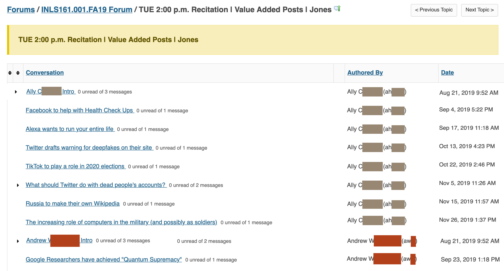

# Basics

## First tool: Browser

First launch any browser and go to <https://sakai.unc.edu/welcome/>. Log in and find the INLS 161 Sakai Site and launch.

## Sakai

Take a look at the navigation items in the left side bar:

**Calendar:** This is where you can find the links for zoom meetings throughout the semester. These may be updated for our recitations.

*I was having problems having full control of the Zoom settings when they were set up by Dr. Bergquist, so if we are not able to get that worked out, I may be changing them; so, don't spend a lot of time putting these links in your own calendar until I can work out the issues with Dr. Bergquist.*

**Home Page and Schedule:** This is the INLS 161 Companion Website. It is embedded in the Sakai Site, but you can navigate to it at this link outside of Sakai. You may want to bookmark this site in your browser: <https://ils.unc.edu/courses/2020_fall/inls161_001/index.html>

**Syllabus:** Read over this on your own before the upcoming lecture this week.

**Lessons:** When you click on the Lessons Link you will see Tasks listed with leading zeros:

* Task 01.01 Introduction on Forum
* Task 01.02 Newletter Signup
* Task 01.03 VPN Setup
* etc.

!>**These tasks will be our main focus in the recitations**. You should look at the Lessons page before each recitation and be aware of the tasks we are planning to work on for that day.

**Assignments:** This is where you submit your work. Pay attention to the due dates. It is important for you not to fall behind or you will get overwhelmed with a backlog of work. **If you attend the recitations, you will most likely be able to keep up with your work.**

## Value Added Items
You will see value added items in the Assignment List. You do not have to submit forum postings in the Assignment Section. Just put your forum post in the appropriate folder for your section. I will find and grade your posts from the forum. Also, you do not need to add a label or tag to your post in Sakai. The label and tag requirement was due to using a system outside of Sakai. We (and you) can now sort your posts by author name. See figure 1:

**Figure 1:**

