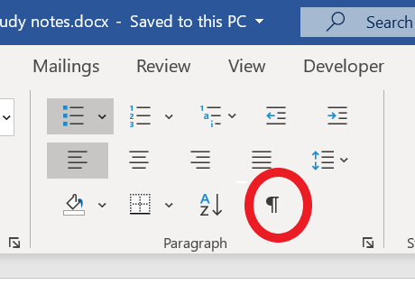

# Part 1: Setup

## Task 3.01 Delete Front Matter

*Delete unnecessary front matter*

Delete everything in the downloaded text up to the title. Your new document should begin with the title of the work.

[ Watch the Video Tutorial for deleting the front matter; Life of the Bee (19 seconds)](https://ils.unc.edu/courses/2017_fall/inls161_001/videos/markup/markup-02-delete-front-matter.mp4)

## Task 3.02 Delete End Matter

*Delete unnecessary end matter*

Using your find tool, search for END OF THIS PROJECT and find the line that looks like this:

<code>END OF THIS</code>

If that does not work, try:

<code>*** END</code>

If that does not work, scroll to the end and then scroll back up to locate the start of the end matter.

Delete that line and all the remaining lines of the document. Your new document should end with the last line of the original work and should not include any of the Project Gutenberg legalese that one normally finds at the end.

[ Watch the Video Tutorial for deleting the end legalese; Life of the Bee (1:07 minutes)](https://ils.unc.edu/courses/2017_fall/inls161_001/videos/markup/markup-03-delete-end-legalese.mp4)

## Task 3.03 Remove extra ^p Markers

*Eliminate unnecessary paragraph markers*

Using your find and replace tools, reformat the e-book to eliminate unnecessary paragraph markers and to permit the text to wrap until it hits an actual paragraph mark.

[ Watch the Video Tutorial for eliminating unnecessary paragraph markers: Life of the Bee (5:18 minutes)](https://ils.unc.edu/courses/2017_fall/inls161_001/videos/markup/markup-04-remove-returns-1.mp4)

*The Video makes reference to the slide show below as being on an Exercise 1 page. That page was confusing, and has been deleted. The link to the mentioned slide show is directly below this line.*

## Task 3.04 Page Setup

*Set Page Size Layout*

Assume the readable area for an e-reader is 4 inches wide by 6 inches high.

If you wish to use other dimensions, explain your decision in a footnote.
## Task 3.05 Margins

Set the margins for the pages to:

* .3 inch margins left and right;

* .5 inch margins top and bottom;

[ Watch the Video Tutorial for page layout and margins; Life of the Bee (1:25 minutes)](https://ils.unc.edu/courses/2017_fall/inls161_001/videos/markup/markup-06-layout-and-margins.mp4)

headers & footers

* set at .3 inches.
* set the headers for Different Odd & Even.

[ Watch the Video Tutorial for setting up header and footer margins and layout; Life of the Bee(42 seconds)](https://ils.unc.edu/courses/2017_fall/inls161_001/videos/markup/markup-07-layout-header-footer-margins.mp4)
